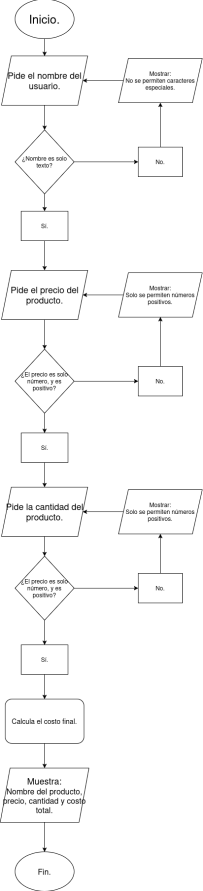

# 🧾 Inventario Programa en Python
## Historia de usuario Mes 1

## 📋 Diagrama de flujo.

## 📌 Descripción

Este es un programa sencillo de **Python** que permite registrar un producto y calcular el precio total a pagar.

## ⚙️ ¿Cómo funciona el programa?

El programa pregunta al usuario por:
- El nombre del producto:
- El precio del producto:
- La cantidad del producto:

Luego realiza el cálculo del total multiplicando:

**precio x cantidad** 

Y finalmente muestra en pantalla:

- El nombre del producto.
- El precio del producto.
- La cantidad del producto.
- El total a pagar.

Además, el programa incluye **validaciones para evitar errores**, como:
 
- No permite números ni caracteres especiales en el nombre del producto.
- No permite números negativos en el precio y la cantidad.
- Solo se permiten números en el precio.
- Solo se permiten números enteros en la cantidad.

## ¿Cómo es el flujo del programa?

El programa utiliza **bucles (`while`) y manejo de errores (`try / except` )** para validar los datos que ingrese el usuario y evitar errores durante la ejecución.

### El flujo del programa es el siguiente: 

1. Se solicita el **nombre del producto**.

2. Se valida que el nombre solo contenga **letras**, evitando números o caracteres especiales.
3. Se solicita el **precio del producto**.
4. Se valida que el precio sea un **número valido** y que **no sea negativo**. 
5. Se solicita la **cantidad del producto**. 
6. Se valida que sea un **número entero** y **no sea negativo**.
7. Se calcula el **total a pagar** multiplicando el **precio** por la **cantidad**. 
8. Finalmente se muestran los datos ingresados junto con el **total calculado**.

---

## 🚀 Como usar el proyecto.

### 1️⃣ Descargar e Instalar Python 3.14.3.
En la siguiente opción se cuentra la url de descarga de Python 👉
[Python Link de Descarga](https://www.python.org/downloads/release/python-3143/)

### 2️⃣ Descargar e Instalar Visual Studio Code.
En la siguiente opción se cuentra la url de descarga de Visual Studio Code 👉 [Visual Studio Code Link de Descarga](https://code.visualstudio.com/download)

### 3️⃣ Descargar e Instalar Git.
En la siguiente opción se cuentra la url de descarga de Python 👉
[Git Link de Descarga](https://git-scm.com/install/)

### 4️⃣ Clonar el repositorio
En su **Escritorio** presione **Click Derecho** y presione donde diga **"Nueva Carpeta"** o parecidos.

Dentro de su carpeta presione **Click Derecho** y presiona la opción que diga **Abrir en una terminal**.

Dentro de la terminar copie y pegue el siguiente comando: **git clone https://github.com/doctorpatitas/Proyecto-_Inventario_Riwi_Python_Diego_Gonzalez.git**

Finalmente introduzca el comando **"code ."** para que le habra **Visual Studio Code** dentro de la carpeta en donde se encuentra ubicado.

### 5️⃣ Ejecutar el programa.
Dentro de **Visual Studio Code** dirigase arriba a la izquierda y presione la opción que diga **Terminal** y luego **New Terminal**

Dentro de la terminal escriba el siguiente comando: **python3 inventario.py**

Y su programa estara ejecutandose exitosamente. 

### Gracias por leer.